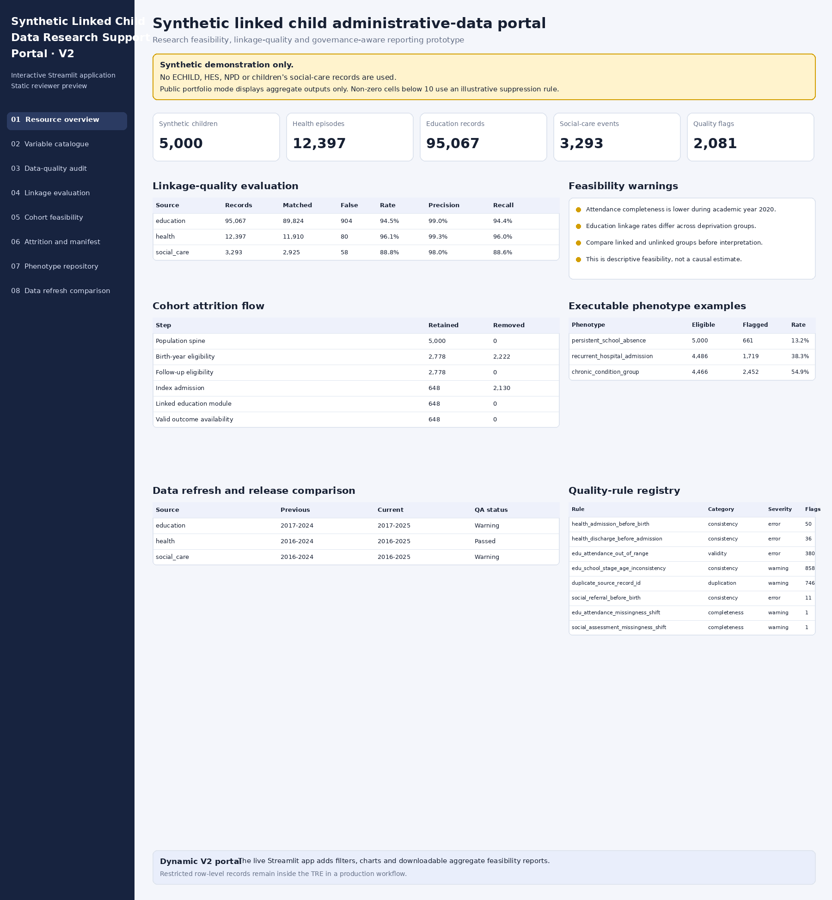
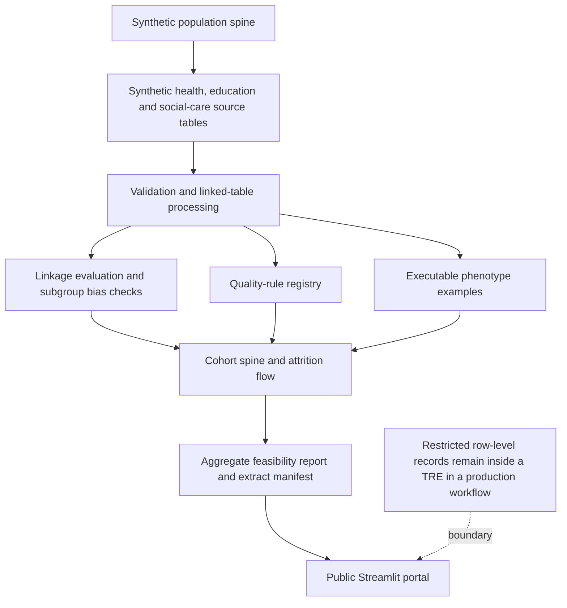

# Synthetic Linked Child Administrative-Data Research Support Portal · V2

A dynamic Streamlit portfolio prototype for research support across fully synthetic linked health, education and children's social-care records.

> **Synthetic demonstration only.** This repository does not use, copy or claim access to ECHILD, Hospital Episode Statistics (HES), the National Pupil Database (NPD) or children's social-care records.
>
> **Public portfolio mode.** The dashboard displays aggregate outputs only. Non-zero cells below a configurable threshold are suppressed using an illustrative rule. This configuration does not claim to reproduce Office for National Statistics Secure Research Service (ONS SRS) output checking.



## 60-second reviewer path

1. Open the dynamic Streamlit app and review the resource overview.
2. Open **Linkage-quality evaluation** and compare linkage rates across deprivation quintiles.
3. Open **Cohort feasibility builder**, select an index-admission cohort and update the filters.
4. Download the aggregate feasibility report, cohort-attrition CSV and extract-manifest YAML.
5. Review executable phenotype examples and the data-refresh comparison.

## What V2 demonstrates

- a synthetic population spine and linked health, education and social-care source tables;
- config-driven data-quality checks for completeness, validity, consistency and duplication;
- linkage evaluation with matched, unmatched, ambiguous, false-link and missed-link summaries;
- subgroup linkage-rate checks to flag possible linkage bias;
- an interactive cohort-spine builder with attrition reporting and feasibility warnings;
- aggregate-only public reporting with illustrative small-cell suppression;
- downloadable aggregate feasibility reports and extract manifests;
- versioned executable phenotype examples;
- release manifests and refresh comparison;
- predefined read-only aggregate SQL examples;
- automated tests and GitHub Actions.

## Architecture



## Dashboard pages

1. **Resource overview**: aggregate record counts, source-year trends and current release status.
2. **Variable catalogue**: metadata, modules, coverage years, completeness, provenance and caveats.
3. **Data-quality audit**: rule registry, attendance missingness over time and regional social-care completeness.
4. **Linkage-quality evaluation**: source-level metrics and subgroup linkage-rate comparisons.
5. **Cohort feasibility builder**: research-question scoping, cohort design, index events, follow-up and module requirements.
6. **Attrition flow and extract manifest**: aggregate cohort reduction steps and YAML requirements.
7. **Phenotype repository**: executable synthetic definitions and prevalence summaries.
8. **Data refresh comparison**: versioned release manifests and quality-assurance status.
9. **Safe aggregate SQL examples**: predefined read-only aggregate queries; free-text SQL is disabled.

## Quick start

```bash
python -m venv .venv
source .venv/bin/activate  # Windows: .venv\Scripts\activate
pip install -r requirements.txt
python run_pipeline.py --n-children 5000
streamlit run app.py
```

The app also generates synthetic records automatically on first launch when processed files are absent.

## Run tests

```bash
python run_pipeline.py --n-children 1500
pytest -q
```

## Deploy with Streamlit Community Cloud

1. Push this repository to GitHub.
2. Create a Streamlit Community Cloud app linked to the repository.
3. Set the entry point to `app.py`.
4. Deploy. The app will generate synthetic demonstration records when required.

## Generated outputs

```text
outputs/
├── dashboard_preview.html
├── dashboard_preview.png
├── feasibility_report.md
├── cohort_attrition.csv
├── extract_manifest.yml
├── linkage_evaluation_summary.csv
├── phenotype_prevalence.csv
├── quality_rule_summary.csv
└── release_diff.csv
```

## Repository layout

```text
app.py                              Dynamic Streamlit portal
run_pipeline.py                     Rebuild all synthetic outputs
config/disclosure_rules.yml         Illustrative public-output rule
config/quality_rules.yml            Quality-rule registry
config/phenotypes.yml               Versioned executable phenotype examples
config/releases/                    Versioned synthetic release manifests
src/generate_synthetic_data.py      Synthetic source-table and linkage generator
src/process_data.py                 Linked tables and aggregate support outputs
src/linkage_evaluation.py           Source-level and subgroup linkage metrics
src/run_quality_checks.py           Data-quality rules and rule summary
src/build_cohort.py                 Cohort spine, attrition and report generation
src/apply_phenotypes.py             Executable phenotype examples
src/disclosure_control.py           Aggregate small-cell suppression
src/refresh_audit.py                Release comparison
src/generate_reports.py             Markdown outputs and static reviewer preview
examples/                           Companion SQL and R examples
tests/                              Automated tests
```

## Governance boundary

A production administrative-data workflow would keep child-level records and row-level extracts inside an approved trusted research environment (TRE). This public project shows code structure and aggregate reporting using invented data. See [`docs/tre_workflow.md`](docs/tre_workflow.md).
